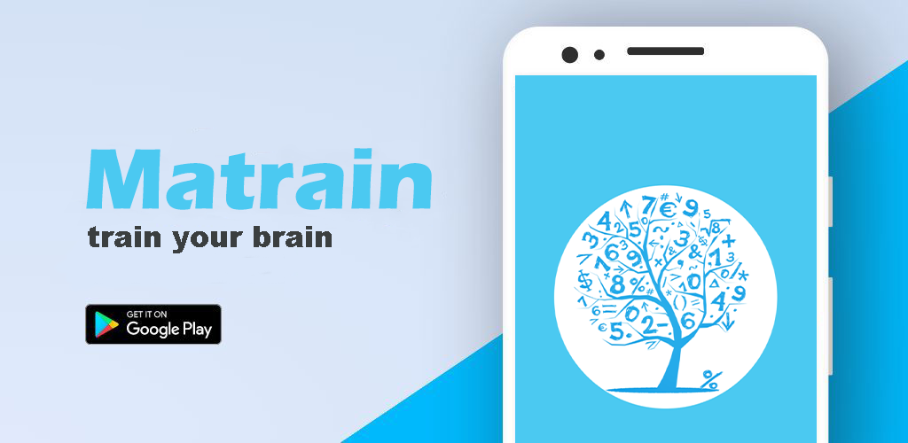
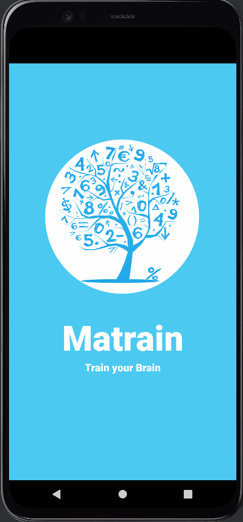
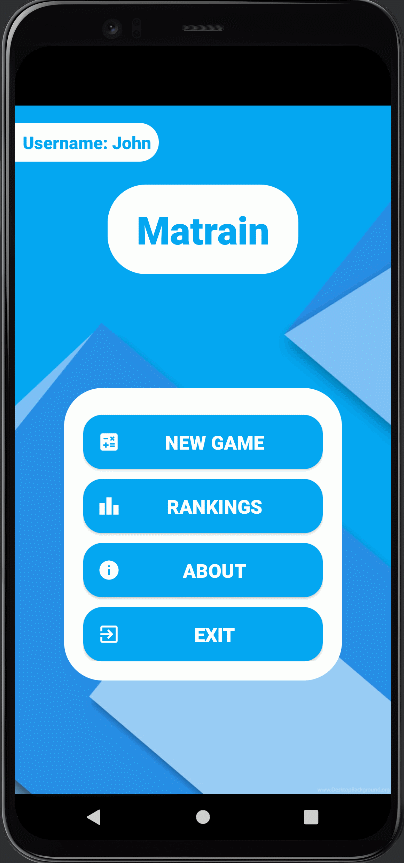
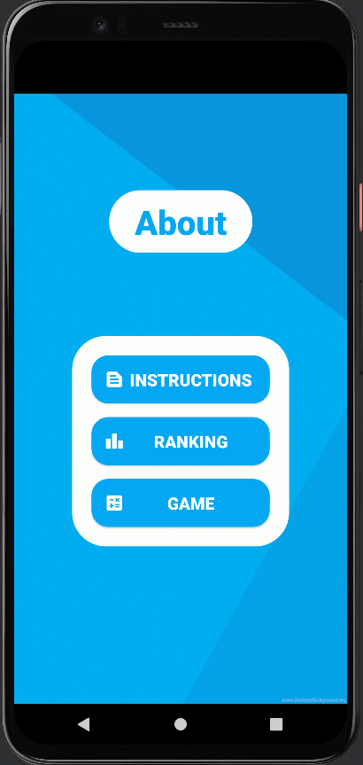

# Matrain_2
# Scheduler - Personal Course Organizer

## Desciption
An efficient educational math game for adults and children who like to solve interesting puzzles and math problems.  

It allows you to improve your mental calculation skills easily and quickly.  

Learn and train:  
- addition  
- subtraction  
- multiplication  
- division  

Share your scores globally and compete with users all over the world.

Everyone will find interesting and funny things to do here.

[Go to Play Store](https://play.google.com/store/apps/details?id=com.matrain.beck)  

## 🎬Preview
||||
|---|---|---|
|<h3 align="center">Gameplay</h3>|<h3 align="center">Rankings</h3>|<h3 align="center">About</h3>|
